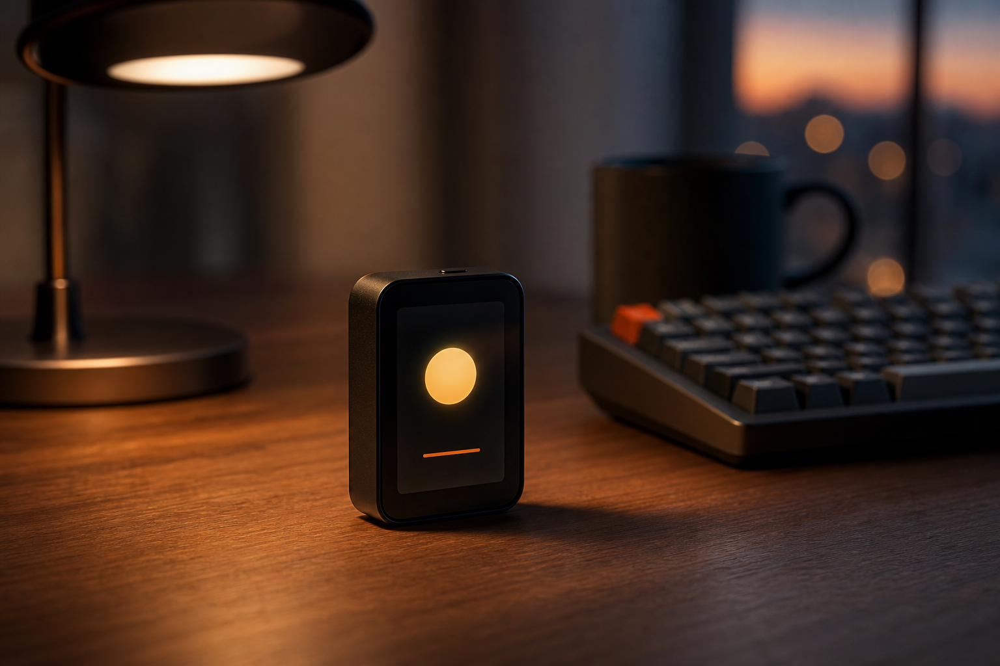
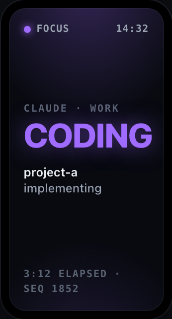
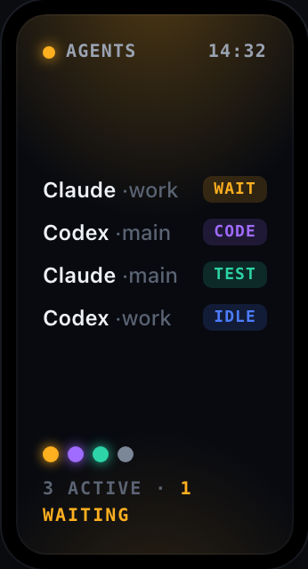
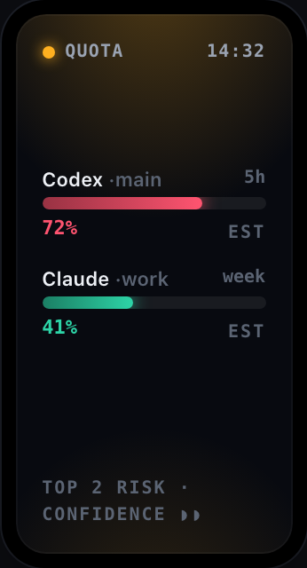
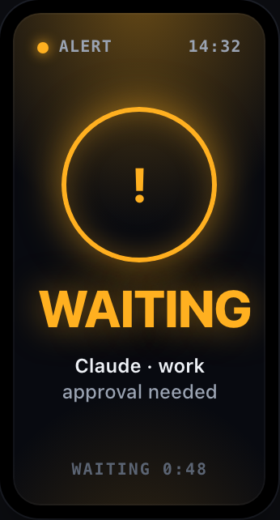
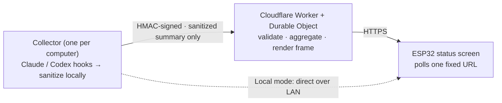

<div align="center">

[简体中文](README.md) · **English**



# AgentLamp

### Give your AI coding agents a face you can **see**.

Know at a glance whether Claude Code / Codex is writing code, thinking, waiting on you, or erroring —
without alt-tabbing or staring at logs. A small screen on your desk, quietly glowing.

<br>


[](https://github.com/MrHulu/agentlamp/stargazers)

</div>

---

> You get up for a glass of water. You come back and stare at the screen — is Claude Code stuck,
> or did it finish ten minutes ago and it's been waiting for you this whole time?
> So you `Cmd-Tab` through windows and scroll logs again, and your flow snaps in half.
>
> **AgentLamp turns that into a glance.** A ~$15 screen sits on the corner of your desk; what your
> agent is doing, you just *see*.

<div align="center">

| Single focus | Agent fleet | Quota warning | Needs you |
|:--:|:--:|:--:|:--:|
|  |  |  |  |
| who's **CODING** | how many machines / agents are busy | 5h / weekly budget | **WAITING / ERROR** flashes red |

<sub>One screen, color-coded by state — purple coding, amber waiting, red error, green done. All 12 states in the design board below.</sub>

</div>

## ✨ What it is

AgentLamp is a **build-it-yourself hardware status screen**: a Waveshare ESP32-S3 panel
(172×320 + RGB LED) that shows, in real time, what the AI coding agents on your computers
(Claude Code / Codex) are doing — coding, thinking, waiting for you, erroring, running low on
quota. One glance, no flow-break.

Published as an **open teaching example of bridging hardware to AI-agent state**: it runs on a
laptop + a ~$15 board in local mode before any cloud. **v1 is single-owner self-host** — no shared
tier, no multi-tenancy, none of your data on someone else's server.

> 💡 **Don't want to buy or solder a board?** Your iPhone can be an AgentLamp first — see the
> [📱 section below](#-no-board-your-iphone-is-an-agentlamp): zero hardware, 5 minutes.

## 🤔 Why you'll want one

- **Agents run long tasks in the background, and you lose the thread**: is it stuck? waiting on you? or done long ago? So you keep alt-tabbing and watching logs — and your flow keeps breaking.
- **Multiple computers / parallel sessions** make it worse — how many are busy, doing what? One screen shows you all of it at once.
- An **always-visible ambient screen** (think Tidbyt-style info displays) turns "how's it going?" from a query you keep running into something you catch in your peripheral vision.
- **Privacy-first, for real**: default-deny sanitization — keys / cookies / raw prompts / source / full paths / real model ids / plan tiers **never leave your machine**.

## 🛠 How it works



**Two modes — start simple, scale when you need to:**

- **Local mode (default, no cloud):** the collector serves a compact JSON frame over your LAN; the ESP32 polls it directly. No domain, no public TLS, no cloud account — plug it in and watch.
- **Relay mode (optional):** to see the screen away from your LAN, the collector pushes **HMAC-signed sanitized summaries** to a Cloudflare Worker + Durable Object relay; the device polls one **fixed** HTTPS URL. **Multi-computer by design** (each joins with a one-line `enroll`); swapping computer / WiFi is fast — the device URL never changes.

**Up and running in 3 steps (local mode):**

```bash
# 1) Install deps + run the local frame server (preview in a browser at http://localhost:8787/preview)
pip install -e ".[server]"
python -m agentlamp_server

# 2) Build + flash the firmware (PlatformIO)
cd firmware && pio run -e waveshare-s3-lcd-147 -t upload

# 3) Boot the device, open its captive portal, enter the frame-server address — done
```

- Hardware BOM + wiring + full quickstart → [`docs/BUILD.md`](docs/BUILD.md)
- Cloud relay deploy (Cloudflare) → [`docs/cloud/deploy.md`](docs/cloud/deploy.md)
- Multi-machine / switch-computer / switch-WiFi "under a minute" → [`docs/runbook/switch-fast.md`](docs/runbook/switch-fast.md)

## 📟 Not just one screen (readers)

Any device that can pull the same JSON frame is a valid **reader**. The cloud / collector is
**agnostic** to which hardware you use — adding a new device **never touches the core**.

| Reader | Hardware | Render | Status | Cost | Code |
|--------|----------|--------|--------|------|------|
| **ESP32 physical lamp** | Waveshare ESP32-S3-LCD-1.47B (172×320 + RGB) | C++ / PlatformIO | ✅ Live, ~4s real-time | ~$15 | [`firmware/`](firmware/) |
| **iPhone widget** | any iPhone (iOS 16+) | Scriptable JS | 🆕 single-file script ready | **zero hardware** | [`readers/iphone-widget/`](readers/iphone-widget/) |

> Both render the **same set of scenes** — only the rendering language and form factor differ. What they share is the **wire contract** (one JSON frame), not rendering code. Full catalog → [`readers/`](readers/).

## 📱 No board? Your iPhone is an AgentLamp

> 🆕 **The newest reader.** Don't want to buy a board, solder, or flash firmware?
> **Any iPhone (iOS 16+) can be a reader, as-is.**

Install the free [Scriptable](https://scriptable.app) app, paste **one** single-file script, set 3 constants — in 5 minutes there's a live AgentLamp widget on your home / lock screen. No in-app purchase, no jailbreak, no developer account.

- **Zero hardware, zero cost:** the iPhone in your pocket is enough — run the whole pipeline on it first, then decide if you want a physical lamp.
- **Aggregated across machines:** the phone reads **one** combined frame across all your computers — how many are busy, who's in focus, all in a single widget.
- **Never blanks:** a network blip won't white-screen it; it caches the last frame, flags it offline, and refreshes when it recovers.
- **Same privacy red lines:** read-only, token rides an `Authorization` header only, and a lost phone is **revocable instantly** (the next refresh flips to `PAIRING REQUIRED` — it refuses to keep showing cached state).
- **Want sub-minute pings?** An optional P2 alert script pushes `WAITING` / `ERROR` to your lock screen via Pushcut.

> iOS throttles widget refresh to ~5–15 min (the OS decides) — perfect for the ambient glance; for instant pings add the P2 alert script.
> Current status: single-file widget implemented + cross-language conformance tests pass, **pending on-device acceptance**.

5-minute phone walkthrough → [`readers/iphone-widget/DEPLOY.md`](readers/iphone-widget/DEPLOY.md)

## 🎨 One screen, every state

Each state has its own accent color and rhythm — boot, pairing, fleet, focus, quota, alert, error,
offline, sleep… and the RGB LED breathes along, so your peripheral vision picks it up. Here's the
full design board (also the source of truth the firmware renders against):

<div align="center">

</div>

## 🔒 Privacy & security

This is the part AgentLamp is most stubborn about — a "display" should never become a leak.

- **Default-deny sanitization:** the collector is the *only* place raw → safe transforms happen; it emits only *enum states / user-defined aliases / keyed-HMAC labels*.
- **The cloud only validates, never re-sanitizes** (independent second gate): it checks the shape of the already-sanitized output and **never** re-runs the transforms in a second runtime (so the two implementations can't silently drift).
- **Never uploaded:** provider cookies / refresh tokens, raw prompts / transcripts, source code, full local paths, real model ids, plan tiers.
- Signed replay protection (HMAC + nonce + timestamp window + idempotency), read-only device tokens (hashed at rest), and **immediate revocation** for a lost device.

> Hard boundary: this device is not a browser — it fetches JSON frames and renders them locally; it does no account switching, quota evasion, request proxying, or cloud credential storage.

## 📦 Hardware

- **Waveshare ESP32-S3-LCD-1.47B** — 1.47" rounded LCD (172×320) + RGB LED, **must have PSRAM** (the framebuffer needs it).
- A **data-capable** USB-C cable (for flashing — not a charge-only one).
- LCD + LED are on-board; no hand-wiring.

## 🧭 Status

Local mode works; the cloud relay is implemented and **deployed + end-to-end verified live**
(Cloudflare Worker + Durable Object + KV). **455 automated tests pass** (Python 315 + TypeScript 125 + iPhone reader 15),
with cross-language consistency locked by a generated parity corpus.
Design + evolution notes: [`docs/devlog/`](docs/devlog/).

## ⭐ Star it if you like it

AgentLamp is a personal after-hours project — built because I was tired of ping-ponging between a
dozen terminal windows and wanted my agents' state to *live* on my desk instead of hiding in tab #7.

- Like the idea → drop a ⭐ so I know someone's watching. It's the most real fuel to keep going.
- Want your own → just `fork` it; local mode runs on a single laptop, follow [`docs/BUILD.md`](docs/BUILD.md).
- Got an idea / want to add a new reader (your e-ink display? a smartwatch?) → issues and PRs welcome.

## 📚 Deeper docs

[Supported hardware / readers](readers/) ·
[Product spec](docs/product/product_spec.md) ·
[Architecture](docs/architecture/architecture.md) ·
[Device frame API](docs/api/device_frame_api.md) ·
[Collector ingest API](docs/api/collector_ingest_api.md) ·
[Security model](docs/security/security_model.md) ·
[Sanitization policy](docs/security/sanitization_policy.md) ·
[Threat model](docs/security/threat_model.md) ·
[Firmware contract](docs/firmware/firmware_contract.md) ·
[Cloud contract](docs/cloud/cloud_contract.md)

## 📄 License

[MIT](LICENSE) © 2026 Hulu (AgentLamp contributors).
Contributions touching `docs/security/` or any sanitization / auth path require a security review
(see [`SECURITY.md`](SECURITY.md) / [`CONTRIBUTING.md`](CONTRIBUTING.md)).
