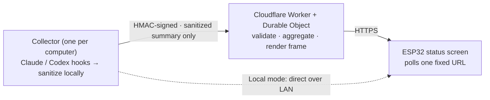

<div align="center">

[简体中文](README.md) · **English**


# AgentLamp

**A physical status screen for your AI coding agents.**

See what Claude Code / Codex are doing at a glance — no window-switching, no log-staring.
A small screen on your desk: live, quiet, privacy-first.


</div>

---

## ✨ What

AgentLamp is a **build-it-yourself hardware status screen**: a Waveshare ESP32-S3 panel
(172×320 + RGB LED) that shows, in real time, what the AI coding agents on your computers
(Claude Code / Codex) are doing — coding, thinking, waiting for you, erroring, running low on
quota. One glance, no flow-break.

| Single focus | Agent fleet | Quota warning | Needs you |
|:--:|:--:|:--:|:--:|
|  |  |  |  |
| who's **CODING** | how many machines / agents are busy | 5h / weekly budget | **WAITING / ERROR** flashes red |

> Published as a **teaching example of bridging hardware to AI-agent state**: local mode runs on a
> laptop + a ~$15 board before any cloud. **v1 is single-owner self-host** (no shared / multi-tenant).

## 🤔 Why

- **Agents run long tasks in the background**, and you lose the thread: is it stuck? waiting on you? or done long ago? So you keep alt-tabbing and watching logs — and your flow keeps breaking.
- **Multiple computers / parallel sessions** make it worse — how many are busy, doing what?
- An **always-visible ambient screen** (think Tidbyt-style info displays) turns all of that into a single glance.
- **Privacy-first, for real**: default-deny sanitization — keys / cookies / raw prompts / source / full paths / real model ids / plan tiers **never leave your machine**.

## 🛠 How



**Two modes:**

- **Local mode (default, no cloud):** the collector serves a compact JSON frame over your LAN; the ESP32 polls it directly. No domain, no public TLS, no cloud account.
- **Relay mode (optional):** to see the screen away from your LAN, the collector pushes **HMAC-signed sanitized summaries** to a Cloudflare Worker + Durable Object relay; the device polls one **fixed** HTTPS URL. **Multi-computer by design** (each joins with a one-line `enroll`); swapping computer / WiFi is fast — the device URL never changes.

**Quickstart (local mode, 3 steps):**

```bash
# 1) Install deps + run the local frame server (preview in a browser at http://localhost:8787/preview)
pip install -e ".[server]"
python -m agentlamp_server

# 2) Build + flash the firmware (PlatformIO)
cd firmware && pio run -e waveshare-s3-lcd-147 -t upload

# 3) Boot the device, open its captive portal, enter the frame-server address — done
```

- Hardware BOM + wiring + full quickstart → [`docs/BUILD.md`](docs/BUILD.md)
- Cloud relay deploy (Cloudflare) → [`docs/cloud/deploy.md`](docs/cloud/deploy.md)
- Multi-machine / switch-computer / switch-WiFi "under a minute" → [`docs/runbook/switch-fast.md`](docs/runbook/switch-fast.md)

## 🔒 Privacy & security

- **Default-deny sanitization:** the collector is the *only* place raw → safe transforms happen; it emits only *enum states / user-defined aliases / keyed-HMAC labels*.
- **The cloud only validates, never re-sanitizes** (independent second gate): it checks the shape of the already-sanitized output and **never** re-runs the transforms in a second runtime (so the two implementations can't silently drift).
- **Never uploaded:** provider cookies / refresh tokens, raw prompts / transcripts, source code, full local paths, real model ids, plan tiers.
- Signed replay protection (HMAC + nonce + timestamp window + idempotency), read-only device tokens (hashed at rest), and **immediate revocation** for a lost device.

> Hard boundary: this device is not a browser — it fetches JSON frames and renders them locally; it does no account switching, quota evasion, request proxying, or cloud credential storage.

## 📦 Hardware

- **Waveshare ESP32-S3-LCD-1.47B** — 1.47" rounded LCD (172×320) + RGB LED, **must have PSRAM** (the framebuffer needs it).
- A **data-capable** USB-C cable (for flashing — not a charge-only one).
- LCD + LED are on-board; no hand-wiring.

## 🧭 Status

Local mode works; the cloud relay is implemented and **deployed + end-to-end verified live**
(Cloudflare Worker + Durable Object + KV). **455 automated tests pass** (Python 315 + TypeScript 125 + iPhone reader 15),
with cross-language consistency locked by a generated parity corpus.
Design + evolution notes: [`docs/devlog/`](docs/devlog/).

## 📚 Deeper docs

[Product spec](docs/product/product_spec.md) ·
[Architecture](docs/architecture/architecture.md) ·
[Device frame API](docs/api/device_frame_api.md) ·
[Collector ingest API](docs/api/collector_ingest_api.md) ·
[Security model](docs/security/security_model.md) ·
[Sanitization policy](docs/security/sanitization_policy.md) ·
[Threat model](docs/security/threat_model.md) ·
[Firmware contract](docs/firmware/firmware_contract.md) ·
[Cloud contract](docs/cloud/cloud_contract.md)

## 📄 License

[MIT](LICENSE) © 2026 Hulu (AgentLamp contributors).
Contributions touching `docs/security/` or any sanitization / auth path require a security review
(see [`SECURITY.md`](SECURITY.md) / [`CONTRIBUTING.md`](CONTRIBUTING.md)).
