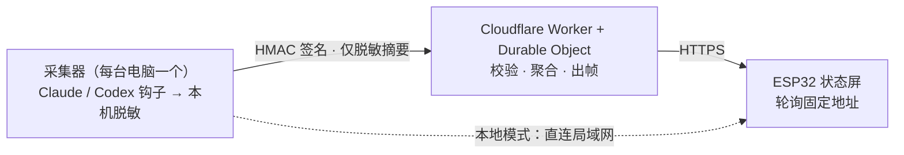

<div align="center">

**简体中文** · [English](README.en.md)


# AgentLamp

**给你的 AI 编程助手，做一块看得见的状态屏。**

一眼看清 Claude Code / Codex 在忙什么 —— 不用切窗口、不用盯日志。
一块放在桌上的小屏，实时、安静、隐私优先。


</div>

---

## ✨ 这是什么（What）

AgentLamp 是一个**自己动手做的硬件状态屏**：一块 Waveshare ESP32-S3 小屏（172×320 + RGB 灯），
实时显示你电脑上 AI 编程助手（Claude Code / Codex）的状态 —— 在写代码、在思考、在等你确认、
报错了、额度快用完了……抬眼一瞥就知道，不打断心流。

| 单会话聚焦 | 多 agent 舰队 | 额度告警 | 需要你处理 |
|:--:|:--:|:--:|:--:|
|  |  |  |  |
| 谁在 **CODING** | 几台机器 / 几个 agent 在忙 | 5 小时 / 每周额度 | **WAITING / ERROR** 闪红提醒 |

> 它作为**「把硬件接到 AI-agent 状态」的教学示例**开源：一台笔记本 + 一块约 $15 的板子就能先跑起本地模式，再谈云端。**v1 是单人自托管**（没有共享 / 多租户）。

## 🤔 为什么（Why）

- **AI 助手在后台跑长任务**，你很容易失去感知：它卡住了？在等你拍板？还是早就跑完了？于是你不停切窗口、盯日志，心流被反复打断。
- **多台电脑 / 多个会话并行**时更乱 —— 到底几个在忙、忙什么？
- 一块**抬眼可见的环境屏**（像 Tidbyt 那类信息屏）把这些变成**一瞥之间**的事。
- **隐私优先不是口号**：默认拒绝（default-deny）脱敏 —— 密钥 / cookie / 原始 prompt / 源码 / 完整路径 / 真实模型名 / 套餐档位，**一律不出本机**。

## 🛠 怎么用（How）



**两种模式：**

- **本地模式（默认，无需云）**：采集器在局域网提供一个紧凑 JSON 帧，ESP32 直接轮询。无域名、无公网 TLS、无云账号。
- **云端中继模式（可选）**：想离开局域网也能看时，采集器把 **HMAC 签名的脱敏摘要**推到一个 Cloudflare Worker + Durable Object 中继，设备走 HTTPS 轮询同一个**固定地址**。**天然支持多台电脑**（每台一行 `enroll` 命令接入），换电脑 / 换 WiFi 都很快 —— 设备地址永不变。

**快速开始（本地模式 · 3 步）：**

```bash
# 1) 装依赖 + 起本地帧服务器（先在浏览器里 http://localhost:8787/preview 看效果）
pip install -e ".[server]"
python -m agentlamp_server

# 2) 编译并刷固件（PlatformIO）
cd firmware && pio run -e waveshare-s3-lcd-147 -t upload

# 3) 设备开机进配网页，填入帧服务器地址 —— 完成
```

- 硬件清单 + 接线 + 完整 quickstart → [`docs/BUILD.md`](docs/BUILD.md)
- 云端中继部署（Cloudflare）→ [`docs/cloud/deploy.md`](docs/cloud/deploy.md)
- 多机 / 换电脑 / 换网「一分钟切换」→ [`docs/runbook/switch-fast.md`](docs/runbook/switch-fast.md)

## 📟 支持的硬件（读取端 / readers）

状态屏不止一种 —— 任何能拉同一份 JSON 帧的设备都是合法「读取端」。云端 / 采集器**不感知**用的是哪种硬件，加一种新设备**永不动核心**。完整目录见 [`readers/`](readers/)。

| 读取端 | 硬件 | 渲染 | 状态 | 效果 | 代码 | 部署 |
|--------|------|------|------|------|------|------|
| **ESP32 实体灯** | Waveshare ESP32-S3-LCD-1.47B（172×320 + RGB） | C++ / PlatformIO | ✅ 已上线 | 桌面小屏，~4 秒实时 | [`firmware/`](firmware/) | [`docs/BUILD.md`](docs/BUILD.md) |
| **iPhone 组件** | 任意 iPhone（iOS 16+） | Scriptable JS | 🆕 单文件脚本就绪，待真机部署 | 主屏/锁屏组件，~5–15 分钟刷新 | [`readers/iphone-widget/`](readers/iphone-widget/) | [`readers/iphone-widget/DEPLOY.md`](readers/iphone-widget/DEPLOY.md) |

> 两者渲染**同一组场景**（聚焦 / 舰队 / 额度 / 告警，即本页顶部那一排图），区别只在渲染语言和形态。iPhone 组件**零硬件成本**：装个免费 App、贴一段单文件脚本、填三个常量即可（见 [`readers/iphone-widget/DEPLOY.md`](readers/iphone-widget/DEPLOY.md)）。

## 🔒 隐私与安全

- **默认拒绝脱敏**：采集器是唯一做「原始 → 安全」转换的地方，只上报*枚举状态 / 用户自定义别名 / 带密钥 HMAC 标签*。
- **云端只校验、不再脱敏**（独立的第二道闸）：它校验已脱敏输出的形状，**绝不**在云端重跑转换逻辑（避免两套实现悄悄跑偏）。
- **永不上传**：provider cookie / refresh token、原始 prompt / 对话、源码、完整本地路径、真实模型 id、套餐档位。
- 签名防重放（HMAC + nonce + 时间窗 + 幂等）、设备只读令牌（散列存储）、丢失设备可**即时吊销**。

> 红线：本设备不是浏览器 —— 它只拉 JSON 帧、本地渲染；不做账号切换、额度规避、请求代理、云端凭证存储。

## 📦 硬件清单

- **Waveshare ESP32-S3-LCD-1.47B** —— 1.47" 圆角 LCD（172×320）+ RGB LED，**需带 PSRAM**（帧缓冲要用）。
- 一根**能传数据**的 USB-C 线（刷机用，别用只充电的）。
- 屏和灯都在板上，无需手工接线。

## 🧭 现状

本地模式可用；云端中继已实现并实测上线（Cloudflare Worker + Durable Object + KV，端到端验证通过）。
**455 个自动化测试通过**（Python 315 + TypeScript 125 + iPhone reader 15），跨语言一致性由生成式 parity 语料锁定。
设计与演进记录见 [`docs/devlog/`](docs/devlog/)。

## 📚 深入文档

[支持的硬件 / readers](readers/) ·
[产品规格](docs/product/product_spec.md) ·
[架构](docs/architecture/architecture.md) ·
[设备帧 API](docs/api/device_frame_api.md) ·
[采集器接入 API](docs/api/collector_ingest_api.md) ·
[安全模型](docs/security/security_model.md) ·
[脱敏策略](docs/security/sanitization_policy.md) ·
[威胁模型](docs/security/threat_model.md) ·
[固件契约](docs/firmware/firmware_contract.md) ·
[云端契约](docs/cloud/cloud_contract.md)

## 📄 License

[MIT](LICENSE) © 2026 Hulu（AgentLamp contributors）。
改动 `docs/security/` 或任何脱敏 / 鉴权路径的贡献需经安全审查（见 [`SECURITY.md`](SECURITY.md) / [`CONTRIBUTING.md`](CONTRIBUTING.md)）。
