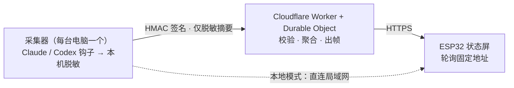

<div align="center">

**简体中文** · [English](README.en.md)


# AgentLamp

### 让你的 AI 编程助手，从此**看得见**。

抬眼一瞥就知道 Claude Code / Codex 在写代码、在思考、在等你拍板，还是报错了——
不切窗口、不盯日志。桌上一块小屏，安静地亮着。

<br>


[](https://github.com/MrHulu/agentlamp/stargazers)

</div>

---

> 你起身接了杯水。回来盯着屏幕——Claude Code 是卡住了，还是十分钟前就跑完、正等着你点下一步？
> 于是你又一次 `Cmd-Tab` 翻窗口、翻日志，心流断在半路上。
>
> **AgentLamp 把这件事变成一抬眼的事。** 一块约 $15 的小屏立在桌角，agent 在干什么，一眼就知道。

<div align="center">

| 单会话聚焦 | 多 agent 舰队 | 额度告警 | 需要你处理 |
|:--:|:--:|:--:|:--:|
|  |  |  |  |
| 谁在 **CODING** | 几台机器 / 几个 agent 在忙 | 5 小时 / 每周额度 | **WAITING / ERROR** 闪红提醒 |

<sub>同一块屏，会随状态变色——紫色在写、黄色等你、红色报错、绿色完成。完整 12 种状态见下方设计板。</sub>

</div>

## ✨ 它是什么

AgentLamp 是一个**自己动手做的硬件状态屏**：一块 Waveshare ESP32-S3 小屏（172×320 + RGB 灯），
实时显示你电脑上 AI 编程助手（Claude Code / Codex）的状态——在写代码、在思考、在等你确认、
报错了、额度快用完了……抬眼一瞥就知道，不打断心流。

它作为**「把硬件接到 AI-agent 状态」的开源教学示例**：一台笔记本 + 一块约 $15 的板子，就能先在本地跑起来，再谈云端。**v1 是单人自托管**——没有共享、没有多租户、没有你的数据上别人服务器这回事。

> 💡 **不想买板子、不想焊接？** 你的 iPhone 就能先当一块 AgentLamp —— 见下方 [📱 一节](#-没有板子你的-iphone-就是一块-agentlamp)，零硬件、5 分钟。

## 🤔 为什么你会想要一个

- **AI 助手在后台跑长任务时，你很容易失去感知**：它卡住了？在等你拍板？还是早就跑完了？于是你不停切窗口、盯日志，心流被反复打断。
- **多台电脑 / 多个会话并行**时更乱——到底几个在忙、忙什么？一块屏帮你一次看全。
- **一块抬眼可见的环境屏**（像 Tidbyt 那类信息屏），把「它现在怎样」从一次次主动查询，变成**余光里的一瞥**。
- **隐私优先不是口号**：默认拒绝（default-deny）脱敏——密钥 / cookie / 原始 prompt / 源码 / 完整路径 / 真实模型名 / 套餐档位，**一律不出本机**。

## 🛠 它怎么工作



**两种模式，先简单后强大：**

- **本地模式（默认，无需云）**：采集器在局域网提供一个紧凑 JSON 帧，ESP32 直接轮询。无域名、无公网 TLS、无云账号——插上电就能看。
- **云端中继模式（可选）**：想离开局域网也能看时，采集器把 **HMAC 签名的脱敏摘要**推到一个 Cloudflare Worker + Durable Object 中继，设备走 HTTPS 轮询同一个**固定地址**。**天然支持多台电脑**（每台一行 `enroll` 命令接入），换电脑 / 换 WiFi 都很快——设备地址永不变。

**3 步跑起来（本地模式）：**

```bash
# 1) 装依赖 + 起本地帧服务器（先在浏览器里 http://localhost:8787/preview 看效果）
pip install -e ".[server]"
python -m agentlamp_server

# 2) 编译并刷固件（PlatformIO）
cd firmware && pio run -e waveshare-s3-lcd-147 -t upload

# 3) 设备开机进配网页，填入帧服务器地址 —— 完成
```

- 硬件清单 + 接线 + 完整 quickstart → [`docs/BUILD.md`](docs/BUILD.md)
- 云端中继部署（Cloudflare）→ [`docs/cloud/deploy.md`](docs/cloud/deploy.md)
- 多机 / 换电脑 / 换网「一分钟切换」→ [`docs/runbook/switch-fast.md`](docs/runbook/switch-fast.md)

## 📟 不止一种屏（读取端 / readers）

任何能拉同一份 JSON 帧的设备，都是合法的「读取端」。云端 / 采集器**不感知**你用的是哪种硬件——加一种新设备**永不动核心代码**。

| 读取端 | 硬件 | 渲染 | 状态 | 成本 | 代码 |
|--------|------|------|------|------|------|
| **ESP32 实体灯** | Waveshare ESP32-S3-LCD-1.47B（172×320 + RGB） | C++ / PlatformIO | ✅ 已上线，~4 秒实时 | 约 $15 | [`firmware/`](firmware/) |
| **iPhone 组件** | 任意 iPhone（iOS 16+） | Scriptable JS | 🆕 单文件脚本就绪 | **零硬件** | [`readers/iphone-widget/`](readers/iphone-widget/) |

> 两者渲染**同一组场景**，区别只在渲染语言和形态——它们共享的是**线上契约**（一份 JSON 帧），而不是渲染代码。完整目录 → [`readers/`](readers/)。

## 📱 没有板子？你的 iPhone 就是一块 AgentLamp

> 🆕 **最新加入的读取端。** 不想买板子、不想焊接、不想刷固件？**任何 iPhone（iOS 16+）都能直接当读取端。**

装一个免费的 [Scriptable](https://scriptable.app)、粘贴**一个**单文件脚本、填 3 个常量——5 分钟，你的主屏 / 锁屏上就有一块实时的 AgentLamp 组件。无需 App 内购、无需越狱、无需开发者账号。

- **零硬件、零成本**：手头的 iPhone 就够，先用它把整套流程跑通，再决定要不要上实体灯。
- **跨机器聚合**：手机读的是所有电脑汇总后的**一块**帧——几台机器在忙、谁在 focus，一个组件全看到。
- **永不空白**：网络抖一下也不会白屏，它缓存上一帧并标记离线，恢复后自动刷新。
- **同一套隐私红线**：只读、token 只走 `Authorization` 头、丢手机可**即时吊销**（下次刷新立刻变 `PAIRING REQUIRED`，绝不继续显示缓存）。
- **想要秒级提醒？** 附带一个可选的 P2 告警脚本，`WAITING` / `ERROR` 经 Pushcut 推到锁屏。

> iOS 把组件刷新限制在 ~5–15 分钟（系统说了算），天生适合"环境感知"那一瞥；要即时 ping 就加 P2 告警脚本。
> 当前状态：单文件组件已实现 + 跨语言一致性测试通过，**待真机部署验收**。

5 分钟手机端走查 → [`readers/iphone-widget/DEPLOY.md`](readers/iphone-widget/DEPLOY.md)

## 🎨 一块屏，说清所有状态

每种状态有自己的主强调色与节奏——开机、配对、舰队、聚焦、额度、告警、报错、离线、休眠……
RGB 灯随状态呼吸，余光就能感知。下面是设计板全貌（也是固件渲染的真实依据）：

<div align="center">

</div>

## 🔒 隐私与安全

这是 AgentLamp 最较真的部分——一块"显示器"不该成为一个泄密点。

- **默认拒绝脱敏**：采集器是唯一做「原始 → 安全」转换的地方，只上报*枚举状态 / 用户自定义别名 / 带密钥 HMAC 标签*。
- **云端只校验、不再脱敏**（独立的第二道闸）：它校验已脱敏输出的形状，**绝不**在云端重跑转换逻辑（避免两套实现悄悄跑偏）。
- **永不上传**：provider cookie / refresh token、原始 prompt / 对话、源码、完整本地路径、真实模型 id、套餐档位。
- 签名防重放（HMAC + nonce + 时间窗 + 幂等）、设备只读令牌（散列存储）、丢失设备可**即时吊销**。

> 红线：这台设备不是浏览器——它只拉 JSON 帧、本地渲染；不做账号切换、额度规避、请求代理、云端凭证存储。

## 📦 硬件清单

- **Waveshare ESP32-S3-LCD-1.47B** —— 1.47" 圆角 LCD（172×320）+ RGB LED，**需带 PSRAM**（帧缓冲要用）。
- 一根**能传数据**的 USB-C 线（刷机用，别用只充电的）。
- 屏和灯都在板上，无需手工接线。

## 🧭 现状

本地模式可用；云端中继已实现并**实测上线、端到端验证通过**（Cloudflare Worker + Durable Object + KV）。
**455 个自动化测试通过**（Python 315 + TypeScript 125 + iPhone reader 15），跨语言一致性由生成式 parity 语料锁定。
设计与演进记录见 [`docs/devlog/`](docs/devlog/)。

## ⭐ 喜欢就留颗 star

AgentLamp 是我下班后捣鼓的个人项目——因为我自己受够了在一堆终端窗口之间反复横跳，想让 agent 的状态"长"在桌上而不是藏在第 7 个标签页里。

- 觉得这个想法有意思 → 点个 ⭐ 让我知道有人在看，这是继续做下去最实在的动力；
- 想要一个自己的 → 直接 `fork`，本地模式一台笔记本就能跑，按 [`docs/BUILD.md`](docs/BUILD.md) 走；
- 有想法 / 想加一种新读取端（你的电子墨水屏？智能手表？）→ 欢迎开 issue 或 PR。

## 📚 深入文档

[支持的硬件 / readers](readers/) ·
[产品规格](docs/product/product_spec.md) ·
[架构](docs/architecture/architecture.md) ·
[设备帧 API](docs/api/device_frame_api.md) ·
[采集器接入 API](docs/api/collector_ingest_api.md) ·
[安全模型](docs/security/security_model.md) ·
[脱敏策略](docs/security/sanitization_policy.md) ·
[威胁模型](docs/security/threat_model.md) ·
[固件契约](docs/firmware/firmware_contract.md) ·
[云端契约](docs/cloud/cloud_contract.md)

## 📄 License

[MIT](LICENSE) © 2026 Hulu（AgentLamp contributors）。
改动 `docs/security/` 或任何脱敏 / 鉴权路径的贡献需经安全审查（见 [`SECURITY.md`](SECURITY.md) / [`CONTRIBUTING.md`](CONTRIBUTING.md)）。
